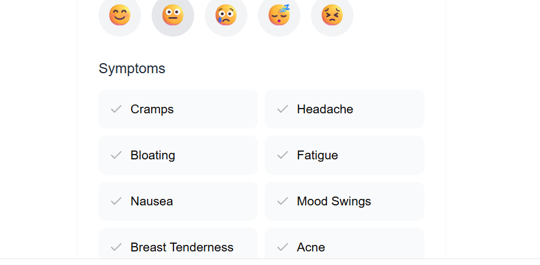
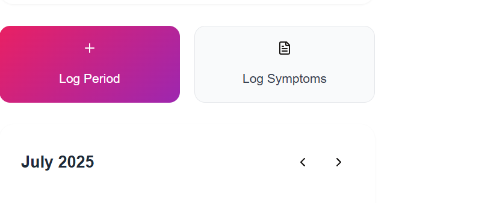

# Menstrual Mate

A modern, privacy-focused menstrual cycle and health tracking app. Menstrual Mate helps users log periods, track symptoms, gain insights, and receive personalized health tips—all in a beautiful, intuitive interface.

---

## 📸 Screenshots

Add your screenshots to the `attached_assets/` folder and reference them here:




---

## ✨ Features

- Period and cycle tracking with calendar view
- Daily symptom and mood logging
- AI-powered insights and pattern recognition
- Personalized health tips and recommendations
- Secure authentication (login/register)
- User profile and settings
- Responsive design for mobile and desktop

---

## 🛠️ Tech Stack

- **Frontend:** React, TypeScript, Vite, Tailwind CSS
- **Backend:** Node.js, Express
- **Database:** Drizzle ORM (see `server/db.ts`)
- **Other:** AI/ML for insights, Toast notifications, Modular component architecture

---

## 🚀 Getting Started

### Prerequisites
- Node.js (v16+ recommended)
- npm or yarn

### Installation

1. **Clone the repository:**
   ```bash
   git clone <your-repo-url>
   cd Menstrual-Mate
   ```
2. **Install dependencies:**
   ```bash
   npm install
   # or
   yarn install
   ```
3. **Set up environment variables:**
   - Copy `.env.example` to `.env` and fill in required values (if applicable).

4. **Run the development servers:**
   - **Frontend:**
     ```bash
     cd client
     npm run dev
     ```
   - **Backend:**
     ```bash
     cd server
     npm run dev
     ```

5. **Open the app:**
   - Visit `http://localhost:3000` (or the port shown in your terminal)

---

## 📁 Folder Structure

```
Menstrual Mate/
  client/         # Frontend React app
    src/
      components/ # UI and feature components
      hooks/      # Custom React hooks
      lib/        # Utilities and logic
      pages/      # App pages/routes
  server/         # Backend API and DB
  shared/         # Shared types/schema
  attached_assets/# Images and screenshots
```

---

## 🤝 Contributing

Contributions are welcome! Please open issues or pull requests for new features, bug fixes, or suggestions.

1. Fork the repo
2. Create your feature branch (`git checkout -b feature/YourFeature`)
3. Commit your changes (`git commit -am 'Add new feature'`)
4. Push to the branch (`git push origin feature/YourFeature`)
5. Open a Pull Request

---

## 📄 License

[MIT](LICENSE) (or specify your license here)

---

## 📬 Contact

For questions or feedback, please open an issue or contact the maintainer at [your-email@example.com]. 